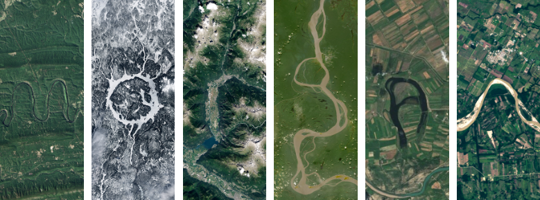

# < Hey, I'm Morgan! />

`B.S. Computer Science + MIS Minor @ Penn State`

 

*ad astra per aspera*

From project and product management to full-stack development --  
**balancing technical detail with a practical, human perspective.**

 

`learning systems` · `driving outcomes` · `questioning the default`

 

─── ✿ ───

 

&nbsp;

---

 ── ✿ &nbsp; Tech Stack &nbsp; ✿ ── 

 

### ⟐ Languages ⟐

 

### ⟐ Interface & Frontend ⟐

 

### ⟐ Backend & Systems ⟐

 

### ⟐ Tools & Infrastructure ⟐

 

### ⟐ Experience ⟐
`Project Management` · `Full-stack development` · `Human-centered system design` · `Team-based execution`

 

---

 ── ✿ &nbsp; GitHub Stats &nbsp; ✿ ── 

 

&nbsp;&nbsp;

 

---

 ── ✿ &nbsp; From Space, With Love &nbsp; ✿ ── 

 

*seen from 438 miles up*

each letter is a real landscape captured by NASA's Landsat satellite · <a href="https://science.nasa.gov/mission/landsat/outreach/your-name-in-landsat/">generate yours ↗</a>

 

<!-- Proudly created with GPRM ( https://gprm.itsvg.in ) -->
